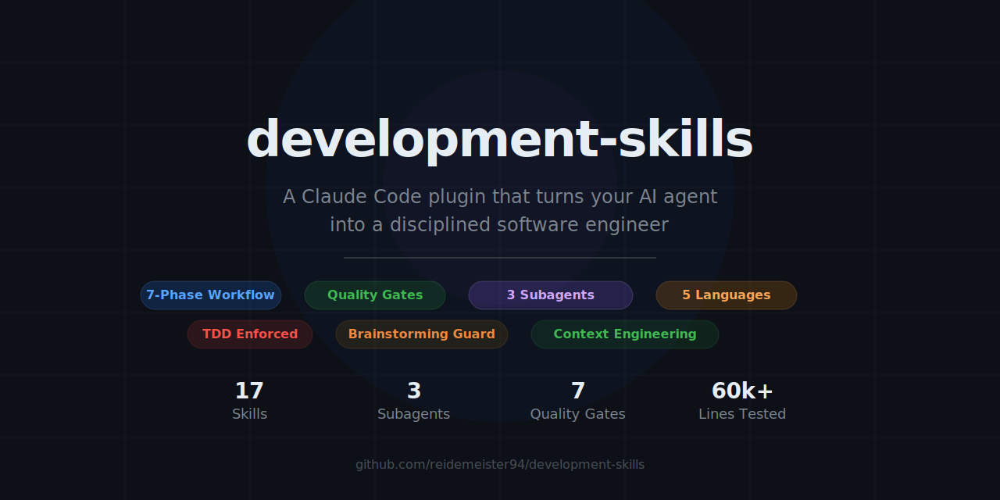
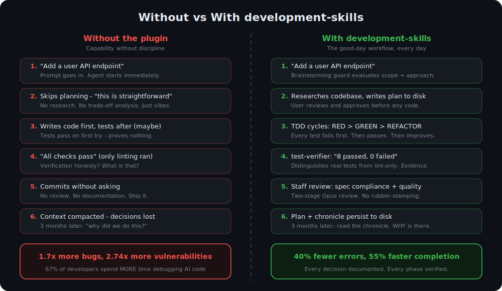
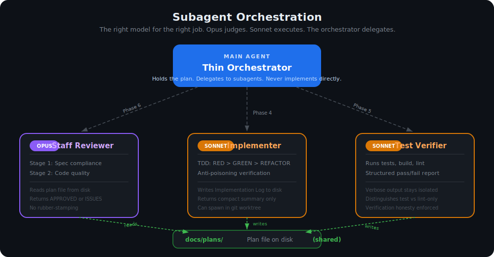
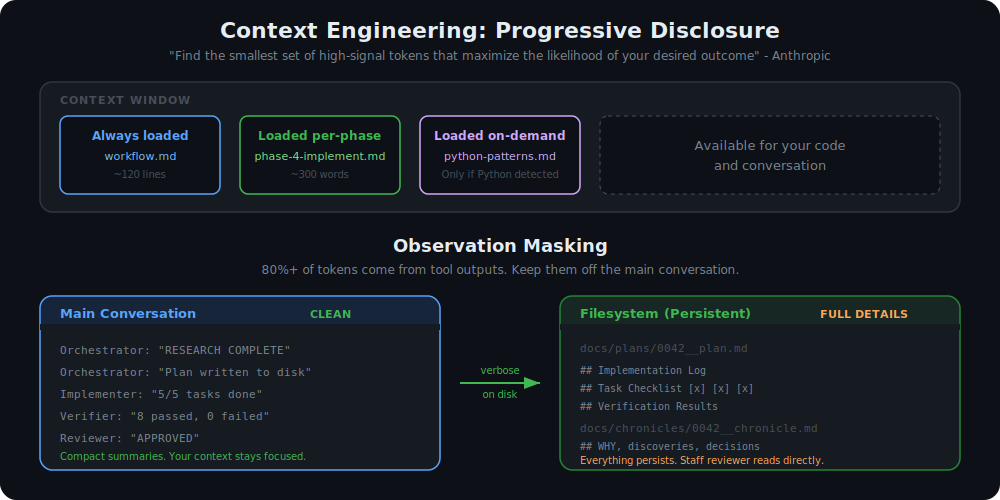

<p align="center">
  
</p>

<p align="center">
  <a href="https://github.com/reidemeister94/development-skills/releases"></a>
  <a href="LICENSE"></a>
  <a href="https://github.com/reidemeister94/development-skills/stargazers"></a>
  <a href="https://github.com/reidemeister94/development-skills/issues"></a>
  
</p>

<p align="center">
  <b>A Claude Code plugin that turns your AI agent into a disciplined software engineer.</b>
</p>

<p align="center">
  <a href="#quick-start">Quick Start</a> &middot;
  <a href="#how-it-works">How It Works</a> &middot;
  <a href="#17-skills-5-languages">17 Skills</a> &middot;
  <a href="#design-philosophy">Philosophy</a> &middot;
  <a href="https://medium.com/@silvio.pavanetto/how-i-taught-agents-to-follow-a-process-not-just-write-code-b135b6573c54">Blog Post</a>
</p>

---

Your AI agent can write code. But can it *follow a process*? Can it research before planning, plan before coding, test before shipping, and review before merging — every single time, without you reminding it?

`development-skills` is a Claude Code plugin that enforces a structured 7-phase development workflow with quality gates, subagent orchestration, and multi-language support. It takes Claude Code's raw capability and channels it through the same disciplined process a senior engineering team follows.

> *"Claude Code gives you a fully stocked workshop. But it doesn't force you to measure twice before cutting."*
>
> — [How I Taught Agents to Follow a Process, Not Just Write Code](https://medium.com/@silvio.pavanetto/how-i-taught-agents-to-follow-a-process-not-just-write-code-b135b6573c54)

<p align="center">
  
</p>

---

## The Problem

AI coding agents are getting faster. But faster isn't better when the process is wrong.

[67% of developers](https://addyo.substack.com/p/the-80-problem-in-agentic-coding) now spend *more* time debugging AI-generated code despite initial velocity gains. Studies show AI co-authored code contains [1.7x more major issues](https://www.elektormagazine.com/articles/2026-an-ai-odyssey-vibe-coding-hangover) and 2.74x more security vulnerabilities than human-written code. Kent Beck [observed](https://newsletter.pragmaticengineer.com/p/tdd-ai-agents-and-coding-with-kent) that agents actively *delete unit tests* to make them pass — optimizing for completion, not correctness.

The core paradox: AI generates code at 140-200 lines/minute, but humans comprehend at 20-40 lines/minute. This creates what researchers call [cognitive debt](https://margaretstorey.com/blog/2026/02/09/cognitive-debt/) — code that works but nobody understands.

The problem isn't capability. It's *discipline*. On a good day, Claude plans carefully, writes tests, reviews its own work, and delivers production-quality code. On a bad day, it skips planning, guesses at solutions, and declares "done" without evidence.

**development-skills makes the good-day workflow the only workflow.**

As Anthropic's own [2026 Agentic Coding Trends Report](https://resources.anthropic.com/hubfs/2026%20Agentic%20Coding%20Trends%20Report.pdf) concluded: success comes from treating agentic development as a *"workflow design problem, not a tool adoption problem."*

<p align="center">
  
</p>

---

## How It Works

When you give Claude Code a development task with this plugin installed, it doesn't just start writing code. Instead, it follows a mandatory gated workflow:

<p align="center">
  
</p>

Each phase is a **gate** — the agent cannot proceed until the gate conditions are met. No skipping. No combining. No "this is trivial, I'll just code it."

### The 7 Phases

| # | Phase | What Happens | Gate |
|---|-------|-------------|------|
| 1 | **Research** | Explore the codebase and gather context | "RESEARCH COMPLETE" |
| 2 | **Plan** | Write a plan to disk, enter plan mode | User approves the plan |
| 3 | **Chronicle** | Document the WHY — business context, requirements, decisions | "CHRONICLE INITIATED" |
| 4 | **Implement** | TDD cycles with dedicated implementer subagent | "SOLUTION COMPLETE" |
| 5 | **Verify** | Dedicated test-verifier runs the full test suite | Evidence of passing |
| 6 | **Staff Review** | Two-stage code review: spec compliance, then quality | "APPROVED" |
| 7 | **Finalize** | Update docs, chronicle, integration options | "WORKFLOW COMPLETE" |

**Small tasks get a fast track.** If a change touches 3 files or fewer with a single obvious approach, the plugin collapses into lightweight mode — same quality checks, no ceremony.

---

## What Makes This Different

### Brainstorming Guard — Think Before You Code

Boris Cherny, creator of Claude Code, [estimates](https://newsletter.pragmaticengineer.com/p/building-claude-code-with-boris-cherny) that *"10 minutes of proper planning consistently saves an hour of debugging."* This plugin enforces that principle architecturally.

Before any coding begins, the plugin evaluates: *Is this task complex enough to require planning?* It checks scope (files affected), reversibility (can we undo this?), approach clarity (is there one obvious way?), and motivation (do we understand WHY?). If any signal is ambiguous, it spawns a dedicated analysis agent that researches, evaluates trade-offs, and proposes approaches — all in an isolated context that doesn't pollute your main conversation.

The default is to analyze. The burden of proof is on *skipping* analysis, not on triggering it. Without this guard, the agent skips brainstorming ~40% of the time on tasks that genuinely need it.

**Anti-rationalization tables** counter the model's tendency to justify shortcuts:

| The model thinks... | The rule says... |
|---|---|
| "User said exactly what to do" | WHAT the user wants is not HOW to build it. Evaluate the HOW. |
| "This is straightforward" | Checking reversibility and alternatives is non-negotiable. |
| "I'll test after" | A test that passes first try proves nothing. RED first. |
| "50GB in memory cache is fine" | That's a flawed premise. Challenge it BEFORE proceeding. |

### Subagent Architecture — The Right Model for the Right Job

The plugin orchestrates three specialized subagents, each with a defined role and model tier:

| Agent | Model | Role |
|-------|-------|------|
| **Staff Reviewer** | Opus | Two-stage code review: spec compliance first, then code quality. No rubber-stamping. |
| **Implementer** | Sonnet | Executes tasks from the approved plan. TDD discipline, anti-poisoning verification. |
| **Test Verifier** | Sonnet | Runs verification commands, returns structured pass/fail with failure details. |

This mirrors how Anthropic's own engineering blog describes [effective sub-agent architectures](https://www.anthropic.com/engineering/effective-context-engineering-for-ai-agents): *"Specialized sub-agents handle focused tasks with clean context windows. Main agent coordinates high-level planning; subagents return condensed summaries despite exploring extensively."*

<p align="center">
  
</p>

Cherny's own workflow validates the approach — he [reports](https://venturebeat.com/technology/the-creator-of-claude-code-just-revealed-his-workflow-and-developers-are) that giving the agent a way to verify its own work *"improves the quality of the final result by a factor of 2-3x."*

### Observation Masking — Clean Context, Full Audit Trail

Tool outputs consume 80%+ of context tokens. The plugin keeps verbose output off the main conversation:

- The implementer writes detailed reasoning to a `## Implementation Log` on disk
- The test-verifier's output stays in its own context
- The staff-reviewer reads the plan file directly from disk
- Your main conversation stays clean for decision-making

Full details are always on disk. Nothing is lost — it's just not cluttering the context window where [attention matters most](https://www.anthropic.com/engineering/effective-context-engineering-for-ai-agents).

### Filesystem Persistence — Survive Context Compaction

Plans, chronicles, and workflow state live on disk, not in the conversation. When Claude Code compacts your context (and it will, on complex tasks), the plugin recovers seamlessly:

1. **WORKFLOW STATE block** at the top of the plan file tracks the current phase
2. **Plan files** in `docs/plans/` persist the full project record
3. **Chronicles** in `docs/chronicles/` capture the WHY behind every change

The agent can resume from any phase, even after a full context clear. Anthropic's data confirms the impact: projects with well-maintained memory files show [40% fewer agent errors and 55% faster task completion](https://resources.anthropic.com/hubfs/2026%20Agentic%20Coding%20Trends%20Report.pdf).

### Smart Parallel Implementation

For tasks with 4+ independent work items, the plugin analyzes file-touch maps, identifies orthogonal groups (tasks that share no files), and spawns parallel implementer agents in git worktrees.

This was learned the hard way. Early attempts at naive parallelization produced [100% unusable code](https://medium.com/@silvio.pavanetto/how-i-taught-agents-to-follow-a-process-not-just-write-code-b135b6573c54) — agents wrote imports to files that had been renamed by other agents. The current approach: single agent by default (sees latest state), parallel only when proven safe via dependency analysis.

### Chronicles — The Missing Layer of Documentation

Most projects have two layers: code (WHAT) and plans (HOW). Chronicles add the third: **WHY**.

Written at both the start and end of each task, chronicles capture business context, requirements rationale, discoveries, failed approaches, and architectural decisions. Named with sequential IDs and dates (`0023__2026-02-17__customer-entity-migration.md`), they form a timeline you can browse with `ls`.

Three months from now, when someone asks "why did we switch from UUID to natural business keys?" — the answer isn't buried in a Slack thread. It's in the chronicle.

---

## 17 Skills, 5 Languages

### Development Skills

| Skill | Trigger | What It Does |
|-------|---------|-------------|
| `core-dev` | Auto (any coding task) | Workflow router — detects language, enforces brainstorming guard, dispatches |
| `brainstorming` | `/brainstorming` | Critical evaluation with isolated analysis agent. Two modes: full analysis, focused evaluation |
| `python-dev` | `/python-dev` | Python patterns — Pydantic, FastAPI, asyncpg, pytest |
| `java-dev` | `/java-dev` | Java patterns — Records, Streams, Spring Boot, JPA |
| `typescript-dev` | `/typescript-dev` | TypeScript patterns — Zod, Express, Fastify, vitest (backend/CLI only) |
| `frontend-dev` | `/frontend-dev` | Auto-detects React, Next.js, Raycast, Vite. Loads framework-specific patterns |
| `swift-dev` | `/swift-dev` | Swift patterns — SwiftUI, UIKit, Vapor, SPM |
| `debugging` | `/debugging` | Systematic root-cause debugging: investigate, analyze, hypothesize, fix |

### Specialized Skills

| Skill | Trigger | What It Does |
|-------|---------|-------------|
| `create-test` | `/create-test` | Risk-scored test design. Explorer mode audits your codebase for dangerous untested code; targeted mode generates boundary, property-based, and invariant tests with strong assertions |
| `distill` | `/distill` | Information-theoretic text compression. Applies Shannon's principle — anything predictable from context carries zero information and can be removed. Measures improvement via gzip entropy ratio |
| `commit` | `/commit` | Conventional commits from staged changes |
| `chronicles` | Auto | Project snapshots capturing the WHY behind changes |
| `align-docs` | `/align-docs` | Align documentation with current project state |
| `eval-regression` | `/eval-regression` | Pre-commit regression testing — compares current version against last committed version |
| `update-precommit` | `/update-precommit` | Update `.pre-commit-config.yaml` hooks to latest versions |
| `update-reqs` | `/update-reqs` | Update `requirements.in` with latest PyPI versions |
| `update-reqs-dev` | `/update-reqs-dev` | Update `requirements-dev.in` with latest PyPI versions |

### Auto-Format on Save

A `PostToolUse` hook automatically formats files when Claude edits them:

| Language | Formatter | Fallback |
|----------|-----------|----------|
| Python | ruff (30x faster than Black) | — |
| JS/TS/CSS/JSON | biome (Rust-based, 7-100x faster) | prettier |
| Java | google-java-format | — |
| Kotlin | ktfmt | ktlint |
| Swift | swift-format | swiftformat |
| HTML/YAML | prettier | — |

---

## Quick Start

### Install

```bash
# From GitHub
claude plugins install --from github:reidemeister94/development-skills
```

### Prerequisites

The [`skill-creator`](https://github.com/anthropics/claude-plugins-official) plugin is required. Enable it in `~/.claude/settings.json`:

```json
{
  "enabledPlugins": {
    "skill-creator@claude-plugins-official": true
  }
}
```

### Usage

The plugin activates automatically on any development task. You can also invoke skills directly:

```
/brainstorming    — Evaluate approaches before committing to one
/debugging        — Systematic root-cause analysis
/create-test      — Design tests that find bugs, not just exist
/distill          — Compress verbose text while preserving facts
/commit           — Conventional commit from staged changes
```

---

## Design Philosophy

### Iron Rules

These rules are enforced at every phase, not just suggested:

1. **No positive claims without evidence.** The agent never says "should work" or "looks good" without fresh verification output.
2. **Red/Green TDD is the starting point.** Every implementation starts with a failing test. No exceptions. Kent Beck is right — TDD becomes [*more* necessary with AI agents](https://newsletter.pragmaticengineer.com/p/tdd-ai-agents-and-coding-with-kent), not less.
3. **Comment the WHY, not the WHAT.** Ambiguous code gets a reason, not a restatement.
4. **No commits without explicit user request.** Passing phases is not permission to commit.
5. **Every gate must be explicitly passed.** "Proceed immediately" means execute the next gate — not skip its requirements.

### Model Behavior Principles

1. **Maximum honesty, zero accommodation.** The model exists to maximize outcomes, not comfort. If the developer's approach is wrong, it says so with evidence.
2. **Critical thinking is always on.** Even outside brainstorming, the model evaluates requests for flaws, wrong assumptions, and symptom-vs-root-cause confusion.
3. **Calibrated criticism only.** Every challenge is concrete, evidence-based, and actionable. No pedantic objections or theoretical concerns.
4. **Planning is 90% of the work.** Brainstorming and planning phases are where quality is decided.
5. **Data-validated decisions.** Approaches validated against online sources and codebase evidence, not training-data patterns alone.
6. **Persist knowledge to disk.** Context windows are ephemeral. Useful information is continuously offloaded to structured files on disk.

---

## Architecture

```
development-skills/
├── .claude-plugin/plugin.json    # Plugin metadata
├── skills/                       # 17 skills
│   ├── core-dev/                 #   Workflow router + brainstorming guard
│   ├── brainstorming/            #   Critical evaluation (isolated analysis agent)
│   ├── python-dev/               #   Python patterns
│   ├── java-dev/                 #   Java patterns
│   ├── typescript-dev/           #   TypeScript patterns (backend/CLI)
│   ├── frontend-dev/             #   React, Next.js, Raycast, Vite (auto-detect)
│   ├── swift-dev/                #   Swift patterns
│   ├── debugging/                #   Systematic root-cause debugging
│   ├── create-test/              #   Risk-scored test design
│   ├── distill/                  #   Information-theoretic text compression
│   ├── commit/                   #   Conventional commits
│   ├── chronicles/               #   Project snapshots (WHY documentation)
│   ├── align-docs/               #   Documentation alignment
│   ├── eval-regression/          #   Pre-commit regression testing
│   ├── update-precommit/         #   Pre-commit hook updater
│   ├── update-reqs/              #   requirements.in updater
│   └── update-reqs-dev/          #   requirements-dev.in updater
├── agents/                       # 3 specialized subagents
│   ├── implementer.md            #   Sonnet — TDD execution
│   ├── staff-reviewer.md         #   Opus — two-stage code review
│   └── test-verifier.md          #   Sonnet — verification execution
├── hooks/                        # Auto-format + session context
├── shared/                       # Workflow engine
│   ├── workflow.md               #   Phase sequence, iron rules, gates
│   └── phases/                   #   Per-phase instructions (loaded just-in-time)
└── commands/                     # Feedback production/ingestion
```

### Progressive Disclosure

The plugin follows Anthropic's recommended [just-in-time context loading](https://www.anthropic.com/engineering/effective-context-engineering-for-ai-agents) pattern. Context is a finite attention budget — every unnecessary token dilutes the model's focus:

- **Always loaded**: `workflow.md` — phase sequence, iron rules, gate definitions (~120 lines)
- **Loaded per-phase**: `phases/phase-N-*.md` — detailed instructions (~300 words each)
- **Loaded on-demand**: routing rules, language patterns, reference files, templates

Each language skill provides only language-specific config. No duplication across skills.

---

## Context Engineering in Practice

This plugin implements many of the patterns described in Anthropic's [Effective Context Engineering for AI Agents](https://www.anthropic.com/engineering/effective-context-engineering-for-ai-agents) and validated by [Manus](https://manus.im/blog/Context-Engineering-for-AI-Agents-Lessons-from-Building-Manus) across millions of production users:

<p align="center">
  
</p>

| Principle | How development-skills Implements It |
|---|---|
| *"Find the smallest set of high-signal tokens"* | Progressive disclosure — load phase instructions just-in-time, not all at once |
| *"Sub-agents return condensed summaries"* | Observation masking — verbose output on disk, summaries in conversation |
| *"Use the file system as extended context"* | Plans, chronicles, workflow state, and implementation logs on disk |
| *"Structured note-taking outside context"* | WORKFLOW STATE blocks survive compaction; chronicles persist business rationale |
| *"Clean context windows for focused tasks"* | Each subagent gets only the context it needs — implementer doesn't see review criteria |
| *"Preserve failure evidence in context"* | Anti-rationalization tables and iron rules keep the model honest under pressure |

---

## Built From Real-World Experience

This plugin was forged in production across 60,000+ lines of Python on real projects — FastAPI backends, legacy database integrations, shared production environments. Every feature exists because its absence caused a real problem:

- **Brainstorming guard** — because the agent kept skipping analysis on tasks that needed it (~40% skip rate without it)
- **Observation masking** — because implementation debugging was polluting the context needed for clear-headed review
- **Single-agent default** — because 8 parallel agents in worktrees produced 100% unusable code (stale branches, broken imports, "all checks pass" when only linting ran)
- **Iron rules with anti-rationalization tables** — because the model would negotiate away its own process under pressure
- **Filesystem persistence** — because context compaction wiped critical decisions mid-workflow
- **Verification honesty** — because agents claimed "all tests pass" when tests hadn't actually run
- **Chronicles** — because three months later, nobody could answer *why* a design decision was made

---

## Featured In

<table>
  <tr>
    <td width="60" align="center"></td>
    <td><a href="https://medium.com/@silvio.pavanetto/how-i-taught-agents-to-follow-a-process-not-just-write-code-b135b6573c54"><b>How I Taught Agents to Follow a Process, Not Just Write Code</b></a><br/><sub>The full story behind this plugin — problems, failures, and solutions</sub></td>
  </tr>
</table>

## Further Reading

The design decisions in this plugin are grounded in research from across the industry:

| Source | What It Covers |
|--------|---------------|
| [Effective Context Engineering for AI Agents](https://www.anthropic.com/engineering/effective-context-engineering-for-ai-agents) | Anthropic's guide to the patterns this plugin implements |
| [Building Claude Code with Boris Cherny](https://newsletter.pragmaticengineer.com/p/building-claude-code-with-boris-cherny) | How the creator of Claude Code thinks about agent workflows |
| [TDD, AI Agents and Coding with Kent Beck](https://newsletter.pragmaticengineer.com/p/tdd-ai-agents-and-coding-with-kent) | Why testing becomes more important with AI, not less |
| [Agentic Engineering](https://addyosmani.com/blog/agentic-engineering/) | Addy Osmani on the shift from vibe coding to structured workflows |
| [Context Engineering: Lessons from Manus](https://manus.im/blog/Context-Engineering-for-AI-Agents-Lessons-from-Building-Manus) | Production-validated context patterns across millions of users |
| [Agentic Workflows for Software Development](https://medium.com/quantumblack/agentic-workflows-for-software-development-dc8e64f4a79d) | McKinsey/QuantumBlack on orchestration vs execution layers |

---

## Regression Testing

The plugin ships with **27 evals and 89 assertions** covering 10 behavioral dimensions — the equivalent of a test suite for agent behavior. Powered by Anthropic's [`skill-creator`](https://github.com/anthropics/claude-plugins-official) plugin.

```
/eval-regression
```

| Category | Evals | What It Tests |
|----------|-------|--------------|
| `brainstorming-guard` | 7 | Triggers analysis when needed, skips when appropriate |
| `smart-isolation` | 6 | Parallel vs single agent decisions, worktree safety |
| `anti-rationalization` | 4 | Resists shortcuts, catches flawed premises |
| `workflow-phases` | 3 | Phase progression, resumption, plan discovery |
| `implementer-discipline` | 2 | TDD enforcement, caller updates, verification honesty |
| `language-detection` | 1 | Frontend vs TypeScript backend routing |
| `chronicle-quality` | 1 | WHY documentation quality |
| `askuserquestion-avoidance` | 1 | Conversational text, not AskUserQuestion tool |
| `turn-boundary` | 1 | Stops at the right moment |
| `project-directives` | 1 | Respects existing project configuration |

Every eval snapshots the committed version as baseline, runs the modified version against the same prompts, grades all assertions, and produces a regression report with a clear verdict: **SAFE TO COMMIT** or **REGRESSIONS FOUND**.

---

## Contributing

Contributions are welcome — especially new language skills. See [CONTRIBUTING.md](CONTRIBUTING.md) for the full guide.

**The golden rule: no PR without a passing regression benchmark.** Run `/eval-regression`, get 100% pass rate, paste `benchmark.md` in your PR. Zero regressions = merge. Regressions = fix first.

**Ideas for contributions:**
- New language skills: Rust, Go, Kotlin, Ruby, C#
- Improved framework patterns for existing languages
- Better anti-rationalization tables
- New evals for uncovered edge cases

Please open an issue to discuss changes before submitting a PR.

## License

MIT

---

<p align="center">
  <b>If this plugin makes your AI agent more disciplined, consider giving it a star.</b><br/>
  <sub>It helps others discover the project and motivates continued development.</sub>
</p>

<p align="center">
  <a href="https://github.com/reidemeister94/development-skills/stargazers"></a>
</p>

<p align="center">
  <a href="https://medium.com/@silvio.pavanetto/how-i-taught-agents-to-follow-a-process-not-just-write-code-b135b6573c54">Read the full story</a> &middot; <a href="https://github.com/reidemeister94/development-skills/issues">Report an issue</a> &middot; <a href="CONTRIBUTING.md">Contribute</a>
</p>
