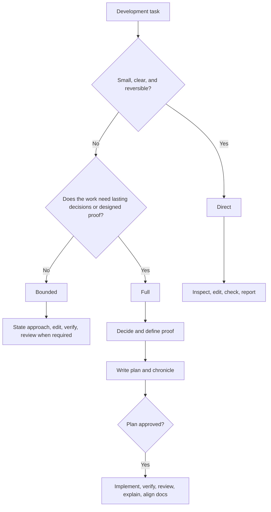

# Development Skills guide

The authoritative workflow is [`shared/development-loop.md`](../shared/development-loop.md).
This guide explains how its parts fit together.

## The three paths



Direct work has one forced approach and one clear check.
Bounded work spans more surface or risk but does not need a persistent decision record.
Full work needs durable reasons, designed proof, or safe continuation across sessions.

Authentication, real data, published contracts, and migrations require at least bounded work and independent review.

## Authorization

An implementation request authorizes clear in-scope edits when no plan exists.
A planning, review, or audit request does not authorize implementation.

When a plan exists, the agent presents it before implementation.
The presentation explains context, changes, exact files, and checks.
The user selects `Approve`, `Edit`, or `Cancel`.
Approval covers the planned implementation, checks, required review fixes, explanation, and documentation alignment.

Protected branches, releases, tags, publishing, production changes, and destructive actions keep their own approval rules.

## Full-path records

Full work creates paired files:

```text
docs/plans/2026-09-19__cache-policy.md
docs/chronicles/2026-09-19__cache-policy.md
```

The plan records the result, design, exact paths, work items, checks, and current step.
The chronicle records the request, decision reasons, rejected alternatives, and useful failed approaches.

The plan links the chronicle instead of duplicating its rationale.
The chronicle links the plan instead of storing execution status.
[`shared/documentation.md`](../shared/documentation.md) defines metadata, lifecycle, and archive rules.

## Proof

`create-test` starts from externally observable behavior.
It prefers black-box and integration proof over mocks and internal call assertions.

New behavior normally starts with a focused failing test.
A refactor starts with a passing characterization baseline and keeps it passing.
A performance claim needs comparable measurements before and after the change.

Every report states what the evidence proves and what remains unchecked.

## Independent review

`staff-review` sends the diff and evidence to a clean-context `staff-reviewer`.
The reviewer reads the change before the requirements and supplied conclusions.

It returns separate verdicts:

- Specification: `MISSING`, `EXTRA`, or `CANNOT_VERIFY`.
- Quality: findings ranked with [`shared/review-categories.md`](../shared/review-categories.md).

Required specification fixes and CRITICAL or HIGH quality findings block completion.
MEDIUM and LOW findings remain visible for the author to decide.

## Skills

| Skill | Purpose |
|---|---|
| `using-development-skills` | Route work through the development loop. |
| `brainstorming` | Resolve consequential choices before planning. |
| `create-test` | Design or implement regression proof. |
| `explain-diff` | Transfer the change's behavior, reasons, and limits. |
| `staff-review` | Run an independent specification and quality review. |
| `roast-my-code` | Present the same factual review with aggressive humor. |
| `refactor` | Audit first, then apply selected behavior-preserving tranches. |
| `simplify-stuff` | Remove content that carries no useful behavior or knowledge. |
| `ui-design-audit` | Report visual consistency and WCAG 2.2 AA findings. |
| `rethink` | Rebuild a weak proposal from first principles. |
| `align-docs` | Repair documentation owners, routes, metadata, and lifecycle. |
| `changelog` | Add or derive Keep a Changelog entries. |
| `commit` | Create a requested Conventional Commit from staged changes. |
| `handoff` | Create a temporary, self-contained session handoff. |
| `resolve-merge` | Resolve merge or rebase conflicts safely. |
| `wrap-up-branch` | Test, review, document, and merge a finished branch after confirmation. |
| `best-practices` | Research current choices with primary evidence. |
| `ai-agent-bench` | Compare Claude Code and Codex on the same code task. |
| `eval-regression` | Check plugin routing or behavior with bounded sessions. |
| `phone-a-friend` | Get a cross-model, read-only second opinion. |
| `plugin-feedback` | Capture or assess evidence-backed plugin improvements. |
| `bro` | Restate technical text in plain language. |
| `update-deps` | Update Python dependencies or pre-commit hooks without changing pin style. |

## Hooks

`session-start` injects the router and writing contract.
`auto-format` runs a formatter when one is available.
`plan-approved` records that the current plan already has approval.

Hooks provide convenience and context. Project checks remain authoritative.

## Repository layout

```text
skills/       Task-specific workflows.
agents/       The clean-context staff reviewer.
shared/       Canonical workflow, engineering, writing, and documentation contracts.
hooks/        Session, formatting, and approval hooks.
evals/        Routing and behavior cases.
scripts/      Deterministic repository checks.
```

The plugin stays language-agnostic.
Target repositories own their language, framework, architecture, and operational conventions.
