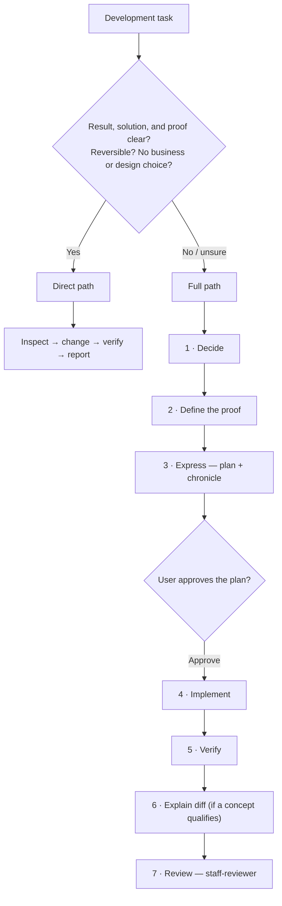

# development-skills — In-Depth Guide

Everything the README doesn't cover: how the workflow runs, why it's built this way, and what each part does. The authoritative source is [`shared/development-loop.md`](../shared/development-loop.md); this guide explains it.

---

## Two paths, not phases

There is no fixed sequence of numbered gates. Each task takes one of two paths, and the agent states which — and why — before changing anything.



**Direct path.** Allowed only when the result, the forced solution, and the proof are all clear, the change reverses easily, and no business or design choice remains. Choosing among viable approaches is itself a design choice, so it disqualifies the direct path. The agent inspects, changes, verifies, and reports.

**Full path.** Everything else. Uncertainty about which path to take means full. A requested review or audit ends with findings and edits only after explicit approval — an approval gate that cannot be reached (user away, autonomous run) is a stop, never a silent downgrade to the direct path.

### The full path, step by step

| Step | What happens |
|---|---|
| **1 · Decide** | Inspect before asking. State the problem, the affected user or system, the solved state, constraints, unknowns, and what would show the proposed answer is wrong. Reach agreement with `brainstorming` unless the change is easily reversible, small, has one forced approach, and its reason cannot affect the implementation. |
| **2 · Define the proof** | Agree on what could expose failure. For non-trivial work, business flows, KPIs, deep integrations, or probabilistic behavior, `create-test` designs the regression proof. |
| **3 · Express** | Research only when external evidence can change the decision. Write the plan and start the chronicle, then present result, checks, out-of-scope, approach, files, and risks — and offer Approve / Edit / Cancel / Chat about. Only an explicit approval after this presentation permits code. |
| **4 · Implement** | Work in small slices and run the nearest useful check after each. When a test can prove behavior, observe it fail before the fix and pass afterward. Delete production code written before its test rather than adapting it. |
| **5 · Verify** | Run fresh outcome checks and repository gates that could fail if the claim were false. Fix root causes; never weaken, skip, or suppress a check. Report pre-existing failures and say what was not checked. |
| **6 · Explain diff** | When the change carries a business, architecture, lifecycle, trade-off, or failure-mode concept worth teaching, `explain-diff` teaches the mental model, then asks free-response questions one at a time. A conscious skip is allowed and does not block review. |
| **7 · Review** | Give the `staff-reviewer` the request, plan, standards, diff, and what verification did and did not cover — never the explanation answers. Fix all blocking findings and rerun affected checks, then finalize the plan and chronicle and invoke `align-docs`. Commit only when explicitly requested. |

A failed proof or a new unknown returns the work to the earliest step it invalidates. An in-progress plan is the persistent state: on resume, the agent reads its current step, standards, chronicle, and verification record and continues there instead of restarting.

---

## Gates enforced at session start

The `session-start` hook injects [`using-development-skills`](../skills/using-development-skills/SKILL.md) before the agent's first decision. It carries the gates that keep the loop honest:

| Gate | Rule |
|---|---|
| **WRITING-GATE** | Read and apply the [writing contract](../shared/writing.md) before the first natural-language output. It covers chat and every text file. |
| **INTERACTION-GATE** | On Claude Code, use `AskUserQuestion` whenever the user must choose among options. On Codex, ask one concise question in chat. |
| **STANDARDS-GATE** | Before the first change, read the project's agent instructions and matching scoped rules, inspect nearby code for local patterns, and state the selected source paths. A full plan records the same paths. |
| **PATH-GATE** | State the chosen path and why before the first mutating action. A silent classification is a skipped gate. "Review and improve" authorizes the review, not the edits. |
| **PLAN-MODE-HANDOFF** | Native Plan mode changes permissions, not the loop. Complete Decide and Define the proof there; after leaving Plan mode, resume the full path at Express, writing the plan and chronicle in completed tool calls before any product or plugin edit. |
| **EXPLAIN-DIFF-GATE** | After Verify and before Review, invoke `explain-diff` through the skill mechanism when a transferable concept exists; otherwise state briefly that none does and continue. This gate does not affect the direct path. |

### The standards gate in detail

Sources apply in order: the current explicit user decision, then project instructions and scoped rules, then shared project conventions and named standards of record, then established local patterns, then model defaults. A named reference project is read only when the higher sources leave an important choice unresolved. Normal work changes only the task's files and necessary dependencies; a repository-convergence or standards-alignment task is the explicit exception that may audit and refactor the whole target.

---

## Plans and chronicles

Every full-path task produces persistent artifacts on disk, numbered incrementally like SQL migrations. A task that gets both a plan and a chronicle shares the same 4-digit prefix:

```
docs/plans/0042__research__auth-refactor.md          # only when research stays useful
docs/plans/0042__2026-03-15__implementation_plan__auth-refactor.md
docs/chronicles/0042__2026-03-15__auth-refactor.md
```

The plugin uses the next free prefix. If merging branches creates duplicate numbers, `resolve-merge` renumbers them safely.

### Plan files

The single source of truth for a task. When context is cleared, the agent resumes by reading it. Its sections come from [`shared/templates/plan-template.md`](../shared/templates/plan-template.md):

| Section | Content |
|---|---|
| **Why this work matters** | The situation, who it affects, and why the work is worth doing. |
| **What will change** | The state when the work is done, and anything deliberately left unchanged. |
| **How it will work** | The solution before the tasks — decisions and reasons, alternatives not chosen, constraints, edge cases, risks, and how to reverse the change. |
| **Work** | A checklist of small results, each with exact files and a check that can expose failure. |
| **How we will check it** | The checks and what each proves, plus what cannot be checked in the environment. |
| **Working record** | Current step, research, chronicle, standards paths, plan-changing decisions, and review result. |

### Chronicles

Chronicles capture what code and plans don't — the WHY. Its sections come from [`shared/templates/chronicle-template.md`](../shared/templates/chronicle-template.md):

| Section | Content |
|---|---|
| **Why we did this** | The request, the prior situation, and why it mattered — with the user's exact wording where it records a decision. |
| **What we learned** | Facts and discoveries a future person or agent will need, with unfamiliar project details explained. |
| **What we decided** | The important choices, their reasons, and useful alternatives that were not chosen. |
| **What changed** | The final state and how it now works, with the exact technical detail needed to maintain it. |
| **Evidence and limits** | What was checked, what the evidence proves, and what remains unknown. |

Both files follow the repository documentation format ([`shared/documentation.md`](../shared/documentation.md)), which applies the Open Knowledge Format to Markdown under any `docs/` directory: each carries a `type` and a one-line `description`, and plans and chronicles carry lifecycle metadata (`status`, `work_status`).

---

## The review subagent

One subagent ships: [`staff-reviewer`](../agents/staff-reviewer.md). Implementation and verification stay in the main thread, so there are fewer handoffs and less state to reconstruct. The reviewer is read-only and reads the changed code before the requirements, so context can remove a false positive but cannot excuse a broken contract.

It works in two stages, using the shared severity scale in [`shared/review-categories.md`](../shared/review-categories.md):

1. **Specification** — is anything required MISSING, or any unrequested change EXTRA? Either returns `SPEC_ISSUES` before quality review begins. A requirement the diff cannot settle is flagged CANNOT_VERIFY and does not block.
2. **Quality** — incorrect behavior, boundaries, failure paths, security, data integrity, concurrency, or performance regressions; needless scope or complexity; over-long functions, duplicated behavior, or weak names; tests that miss the real regression; and claims unsupported by their evidence.

It reports only concrete failures in changed or scoped code, excluding untouched problems, tool-detectable lint or format errors, preferences, and implausible hypotheticals. CRITICAL, HIGH, and MEDIUM findings must be fixed before merge; LOW is optional and agreed with the user.

---

## Hooks

The hooks (registered in [`hooks/hooks.json`](../hooks/hooks.json)) run on Claude Code and Codex 0.131+ automatically; Codex 0.128–0.130 needs `[features] plugin_hooks = true` in `~/.codex/config.toml`.

| Hook | Event | Purpose |
|---|---|---|
| [`session-start`](../hooks/session-start) | session start, `/clear`, `/compact` | Injects the `using-development-skills` router before the first decision, since skill auto-discovery can run too late. |
| [`auto-format`](../hooks/auto-format) | after `Edit`/`Write`/`MultiEdit`/`apply_patch` | Best-effort formatting for the edited file only. |
| [`plan-approved`](../hooks/plan-approved) | after `ExitPlanMode` | Marks the handoff back into the full path. |

`auto-format` is a convenience that reaches for whatever formatter is on `PATH`; it is not a claim that the plugin ships language conventions:

| Language | Formatter | Fallback |
|---|---|---|
| Python | ruff | — |
| JS/TS/CSS/JSON | biome | prettier |
| Java | google-java-format | — |
| Kotlin | ktfmt | — |
| Swift | swift-format | swiftformat |

If no formatter is installed, the file is left untouched.

---

## Skills reference

All skills are auto-triggered by their description or invoked with `/name`. `using-development-skills` is loaded automatically at session start.

### Workflow

| Skill | What it does |
|---|---|
| `using-development-skills` | The router: reads the development loop and chooses the direct or full path. |
| `brainstorming` | Clarifies an ambiguous or consequential change when more than one sound approach exists. |
| `create-test` | Defines or implements the regression proof: strategy, black-box/integration tests, KPIs, thresholds, and audits. |

### Review & quality

| Skill | What it does |
|---|---|
| `staff-review` | Factual, staff-level review of a branch, diff, repo, directory, or file. |
| `roast-my-code` | The same factual review with aggressive humor; `--fix` can apply selected CRITICAL/HIGH fixes. |
| `simplify-stuff` | Deep simplification pass over a target's files, docs, skills, or plugins. |

### Docs & release

| Skill | What it does |
|---|---|
| `align-docs` | Aligns stale docs, README, rules, plans, chronicles, and `ATLAS`; `--clean` for corpus-wide cleanup. |
| `changelog` | Adds CHANGELOG entries, derives them from commits, or cuts a Keep a Changelog / SemVer release. |
| `commit` | Creates a Conventional Commit from the staged changes on request. |
| `handoff` | Writes a self-contained temporary document to transfer the session to a new chat. |
| `resolve-merge` | Resolves an active merge or rebase conflict, including safe renumbering of colliding plans and chronicles. |

### Research & evals

| Skill | What it does |
|---|---|
| `best-practices` | Researches current best practices and turns the evidence into a clear recommendation. |
| `explain-diff` | Explains a diff, branch, PR, or review packet when the change teaches a useful concept. |
| `eval-regression` | Checks a plugin or skill with behavioral evals, comparing against HEAD to catch regressions. |
| `ai-agent-bench` | Compares Claude Code and Codex on the same real task with isolated worktrees, identical gates, transcripts, time, and cost. |
| `plugin-feedback` | Produces factual feedback on this plugin, or ingests a report to apply only evidence-backed simplifications. |

---

## Repository layout

```
skills/          16 skills (workflow · review · docs & release · research & evals)
agents/          1 subagent (staff-reviewer)
hooks/           session-start · auto-format · plan-approved
shared/          development-loop · writing · documentation · review-categories · skill-authoring · templates/
docs/            plans/ · chronicles/ · this guide
```

`shared/` holds the whole methodology and nothing language-specific:

| File | Owns |
|---|---|
| [`development-loop.md`](../shared/development-loop.md) | The authoritative loop: paths, steps, standards gate, and working rules. |
| [`writing.md`](../shared/writing.md) | The writing contract for every piece of natural language. |
| [`documentation.md`](../shared/documentation.md) | The repository documentation format (Open Knowledge Format). |
| [`review-categories.md`](../shared/review-categories.md) | The CRITICAL / HIGH / MEDIUM / LOW severity scale. |
| [`skill-authoring.md`](../shared/skill-authoring.md) | The reduce-gate every new or edited skill must pass. |
| [`templates/`](../shared/templates/) | Plan and chronicle templates. |

---

## Further reading

- [Effective context engineering for AI agents](https://www.anthropic.com/engineering/effective-context-engineering-for-ai-agents) — the disk-as-memory and clean-subagent patterns this plugin applies.
- [Context engineering: lessons from Manus](https://manus.im/blog/Context-Engineering-for-AI-Agents-Lessons-from-Building-Manus) — the same ideas validated in production.
- [TDD, AI agents and coding with Kent Beck](https://newsletter.pragmaticengineer.com/p/tdd-ai-agents-and-coding-with-kent) — why a failing test first matters more with AI.
- [Agentic engineering](https://addyosmani.com/blog/agentic-engineering/) — structured workflows for coding agents.
